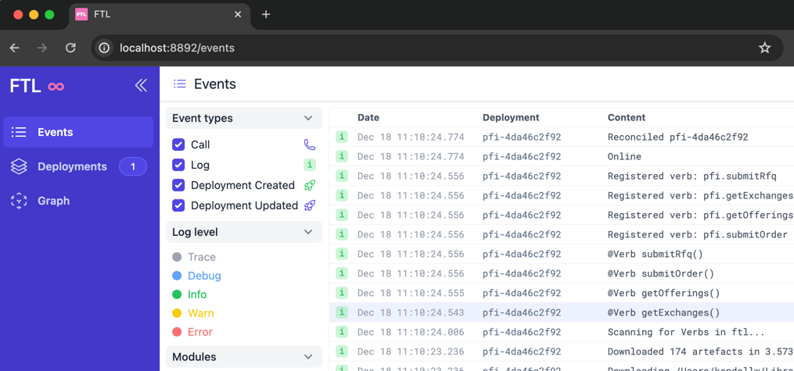

# tbdex-pfi-exemplar/ftl

## Prerequisites

- Docker
- [Hermit](https://cashapp.github.io/hermit/usage/get-started/)
- NodeJS (for using `client/`)

## Getting Started

### 1. Start Postgres & Run Migrations

```shell
(cd ../db/scripts; ./start-pg; ./migrate)
```

### 2. Activate [Hermit](https://cashapp.github.io/hermit/usage/get-started/)

> [!NOTE]
>
> You can skip this step if you have [shell_hooks](https://cashapp.github.io/hermit/usage/shell/) installed to automatically activate hermit environments

```shell
source ./bin/activate-hermit
```

### 3. Start your FTL cluster 

> [!NOTE]
>
> `ftl serve --recreate` will recreate the FTL cluster from a fresh state, i.e. delete all deployed modules

```shell
ftl serve 
```

### 4. In a new shell, start the development server

> [!NOTE]
>
> This will begin hot-reloading (watching for any code changes, and automatically re-deploying)
>
> Alternatively, if you don't want to hot-reload, you can manually deploy FTL modules using the `ftl deploy` command (ex: `ftl deploy ftl-module-offerings`)
>
> Changes to the `lib/` will not automatically redeploy any modules

```shell
ftl dev .
```

### 5. Go to http://localhost:8892/ in your web browser



### 6. Run a full client integration

```shell
(cd client/; npm install; npm run integration;)
```